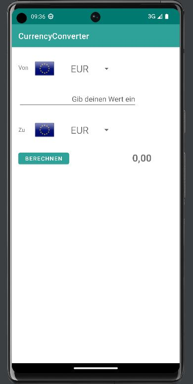
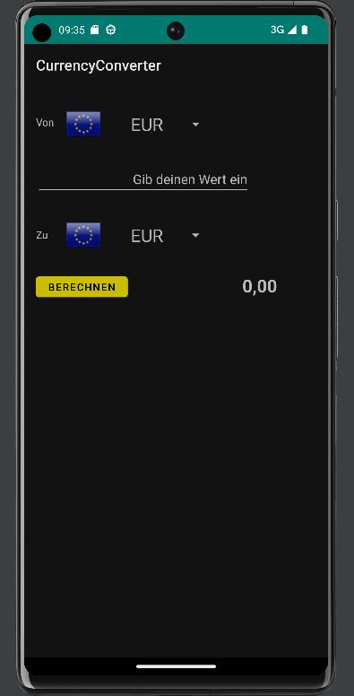
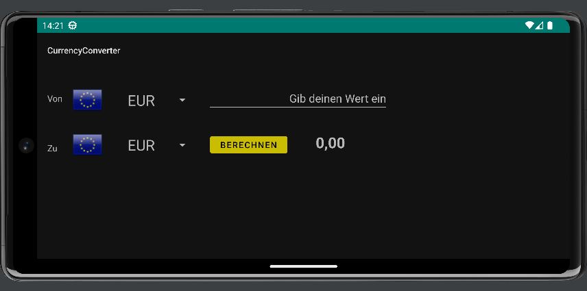

  

[![Stargazers][stars-shield]][stars-url]
[![Issues][issues-shield]][issues-url]
[![MIT License][license-shield]][license-url]  
[](https://github.com/bircni/CurrencyConverter/actions/workflows/android.yml) 
[](https://github.com/bircni/CurrencyConverter/actions/workflows/dependency-review.yml)  

# CurrencyConverter

## About The Project

 A small Android App to convert currencies

## Screenshots

  



### Prerequisites

* Android Studio
* Android SDK
* Android N (API 24) or higher

### Installation

1. Clone the repo

   ```sh
   git clone https://github.com/bircni/CurrencyConverter.git
   ```

2. Open in Android Studio
3. Run on emulator or device

<!-- CONTRIBUTING -->
## Contributing

If you want to contribute - open an issue or a pull request.

1. Fork the Project
2. Create your Feature Branch (`git checkout -b feature/CurrencyCool`)
3. Commit your Changes (`git commit -m 'added something new'`)
4. Push to the Branch (`git push origin feature/CurrencyCool`)
5. Open a Pull Request


[contributors-shield]: https://img.shields.io/github/contributors/bircni/CurrencyConverter.svg
[contributors-url]: https://github.com/bircni/CurrencyConverter/graphs/contributors
[forks-shield]: https://img.shields.io/github/forks/bircni/CurrencyConverter.svg
[forks-url]: https://github.com/bircni/CurrencyConverter/network/members
[stars-shield]: https://img.shields.io/github/stars/bircni/CurrencyConverter.svg
[stars-url]: https://github.com/bircni/CurrencyConverter/stargazers
[issues-shield]: https://img.shields.io/github/issues/bircni/CurrencyConverter.svg
[issues-url]: https://github.com/bircni/CurrencyConverter/issues
[license-shield]: https://img.shields.io/github/license/bircni/CurrencyConverter.svg
[license-url]: https://github.com/bircni/CurrencyConverter/blob/main/LICENSE
