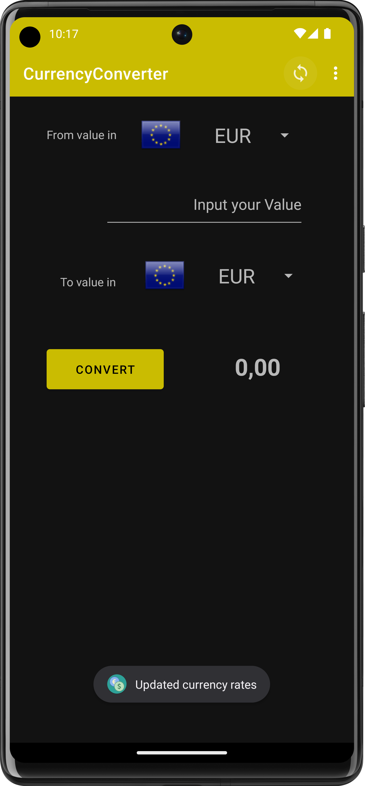
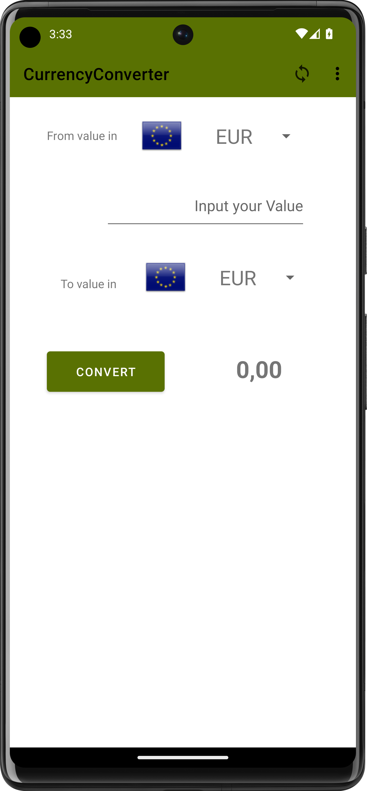

[](https://github.com/bircni/CurrencyConverter/actions/workflows/android.yml)

# CurrencyConverter

<div align="center">
<a href='https://github.com/bircni/CurrencyConverter/releases/latest'></a>
</div>

## About The Project

A small Android App to convert currencies.

- Supports multiple currencies and offline mode.
- Uses [EuropeanCentralBank API](https://www.ecb.europa.eu) to fetch the latest exchange rates.
- Uses [Paper](https://github.com/pilgr/Paper) to store the exchange rates locally.
- Currency rates are updated every 24 hours.
- Languages: German, English (default)

## Screenshots

<div align="center">


</div>

### Prerequisites

- Android Studio
- Android SDK
- Android N (API 24) or higher

### Installation

1. Clone the repo

   ```sh
   git clone https://github.com/bircni/CurrencyConverter.git
   ```

2. Open in Android Studio
3. Run on emulator or device

## Contributing

If you want to contribute - open an issue or a pull request.

1. Fork the Project
2. Create your Feature Branch (`git checkout -b feature/CurrencyCool`)
3. Commit your Changes (`git commit -m 'added something new'`)
4. Push to the Branch (`git push origin feature/CurrencyCool`)
5. Open a Pull Request

## Thanks to

<a href="https://iconscout.com/icons/github-brand-logo" target="_blank">Github Logo Icon</a> by <a href="https://iconscout.com/contributors/adi-sinchetru" target="_blank">Adi Sînchetru</a>  
